# Test Report Parser

Скрипт для получения отчёта голосового робота, извлечения уникальных номеров телефонов, генерации Excel-файла и отправки его на почту.

---

## Цель проекта

Автоматически:
1. Получать отчёт через API `test_report`
2. Собирать **уникальные** номера телефонов (`msisdn`)
3. Создавать Excel-файл
4. Отправлять файл на почту `ykuzmin@fromtech.ru`
5. Уведомлять о процессе и ошибках в Telegram-бот

---

## Алгоритм работы

## Как запустить 